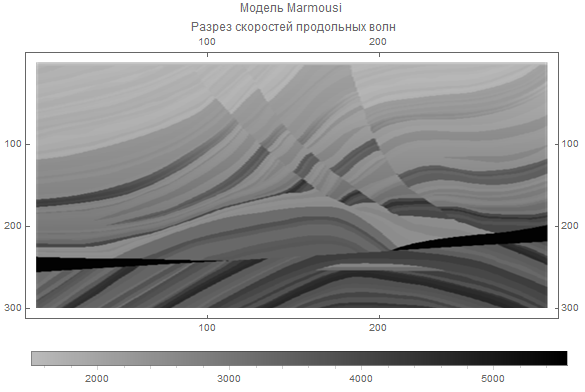

# Нестандартный Импорт и Экспорт - Примеры Использования

## Загрузка и Отображение Модели "Marmousi"

Сейсмогеологическая модель "Marmousi" была создана в во Французском Институте Нефти в 1988 году. 
Геометрия этой модели основана на геологическом разрезе северной части Анголы. 
Модель предназначена для расчета синтетических волновых полей и тестирования передовых методов обработки 
сейсмической информации. Больше информации об этой модели по [ссылке](http://www.ahay.org/RSF/book/data/marmousi/paper.pdf). 

Выполним загрузку контекста: 

```mathematica
<<NonStandartImportExport`
```

Файл с данными модели Marmousi располагается в ресурсной директории проекта. 
Тогда путь к этому файлу можно получить следующим образом: 

```mathematica
file = 
FileNameJoin[{$NonStandartImportExportDirectory, "Resources", "MarmousiModel.segy"}]

(* <ProjectDir>/Resources/MarmousiModel.segy *)
```

Теперь импортируем данные из этого файла с помощью функции импорта из пакета: 


```mathematica
data = NonStandartImport[file, "SEGY"]

(* SEGYData[{"TextHeader" -> ...}] *)
```

Как результат нам вернется объект SEGYData, который содержит всю информацию из файла "MarmousiModel.segy". 
Чтобы получить данные измерения в виде списка трасс достаточно выполнить вот такой код: 

```mathematica
tracks = data[["Tracks"]]

(* {{1500., .. <299>}, .. <297>} *)
```

В результате в переменной **tracks** будет храниться матрица размерностью {298, 300}, 
заполненная измерениями скоростей продольных волн. 
Отобразить полученные данные на графике можно так: 

```mathematica
ArrayPlot[Transpose[data1[["Tracks"]]], 
AspectRatio -> 0.5, ImageSize -> Large, PlotLegends -> Automatic, FrameTicks -> Automatic, 
PlotLabel -> "Модель Marmousi \n Разрез скоростей продольных волн"] 
```



## Связанные Руководства

[Нестандартный Импорт и Экспорт - Руководство](../Guides/Guide.md)
